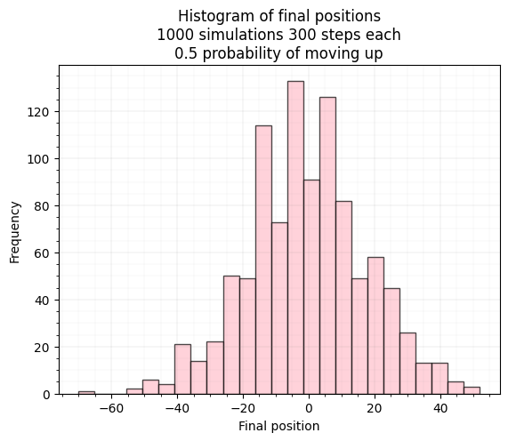
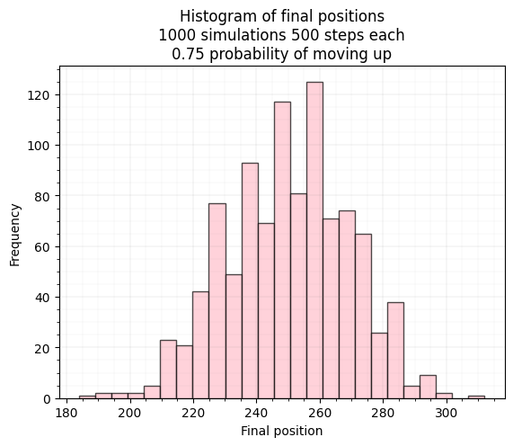
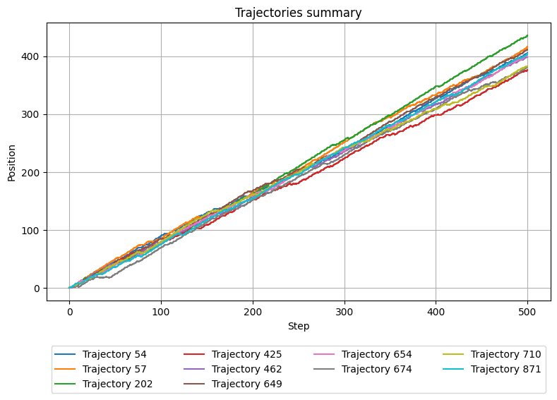
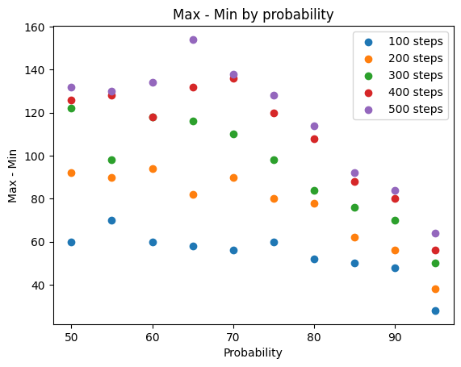
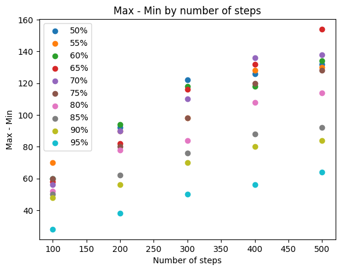
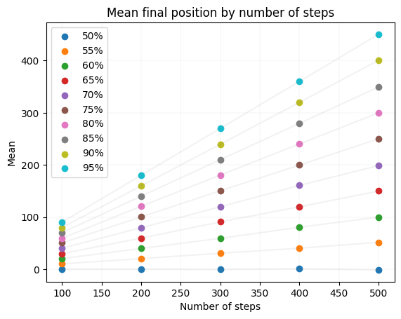

# Symulacja wędrówki losowej

**REDACTED**

[TOC]

## Zasymulować wędrówkę losową dla różnych wartości p oraz liczby kroków N.

### Instalacja i uruchomienie

Symulacja oraz tworzenie wykresów zostały zaimplementowane w pliku `main.py`. W celu uruchomienia symulacji należy wykonać poniższe polecenie:

```bash
pip install -r requirements.txt && python main.py
```

Lub używając venv:

```bash
python3 -m venv .venv && source .venv/bin/activate && pip install -r requirements.txt && python main.py
```

### Krótki opis działania

Program przeprowadza eksperymenty dla wszystkich kombinacji następujących parametrów:

| Parametr                                   | Symbol | Jednostka | Możliwe wartości               |
| ------------------------------------------ | ------ | --------- | ------------------------------ |
| Liczba symulacji na experyment             | M      | liczba    | 1000                           |
| Prawdopodobieństwo ruchu cząsteczki w górę | p      | %         | [50%, 55%, 60%, ..., 90%, 95%] |
| Liczba kroków w symulacji                  | N      | Liczba    | [100, 200, 300, 400, 500]      |

[[ x ]] podstawione zmienne z tabeli powyżej

Dla każdego eksperymentu zapisuje :

-   [surowe wyniki](#wyniki-poszczególnych-symulacji) dla danej każdej z 1000 symulacji z danego eksperymentu
    Lokalizacja: `rawdata/results_[[ p ]]_[[ N ]].csv`

-   wiersz do tabeli ["wyniki zbiorcze"](#wyniki-zbiorcze) dotyczący wskaźników pozycji końcowej cząsteczki
    Lokalizacja: `cumulative_results.csv`
-   [Wykreś średniej pozycji po N krokach + 95% przedział ufności](#średnia-pozycja-cząsteczki-po-n-krokach-z-uwzględnieniem-95%-przedziału-ufności) 
    Lokalizacja: `charts/mean/mean_95_percent_confidence_interval_[[ p ]]_[[ N ]].png`
-   [Histogram pozycji końcowych](#histogram-pozycji-końcowych-dla-różnych-wartości-p)
    Lokalizacja: `charts/histograms/histogram_[[ p ]]_[[ N ]].png`
-   [Wykres zbiorczy 10 losowych przykładowych trajektorii wędrówki](#przykładowe-trajektorie-wędrówki.)
    Lokalizacja: `charts/trajectories/trajectories_summary_[[ p ]]_[[ N ]].png`
-   [Wykres 10 pojedynczych losowych przykładowych trajektorii wędrówki](#przykładowe-trajektorie-wędrówki.)
    Lokalizacja: `charts/trajectories/trajectories_random_[[ p ]]_[[ N ]].png`
-   [Punkt na wykresie zależności rozpiętości pozycji końcowych ze względu na `p`](#jak-zmienia-się-średnia-pozycja-oraz-rozkład-pozycji-końcowych-dla-różnych-wartości-p?)
    Lokalizacja: `charts/max_minus_min_by_probability.png`
-   [Punkt na wykresie zależności średnich pozycji końcowych ze względu na `p`](#jak-zmienia-się-średnia-pozycja-oraz-rozkład-pozycji-końcowych-dla-różnych-wartości-p?)
    Lokalizacja: `charts/mean_final_position_by_probability.png`
-   [Punkt na wykresie zależności rozpiętości pozycji końcowych ze względu na `N`](#jak-liczba-kroków-n-wpływa-na-rozrzut-wyników-(rozpiętość-końcowych-pozycji)?)
    Lokalizacja: `charts/max_minus_min_by_number_of_steps.png`
-   [Punkt na wykresie zależności średnich pozycji końcowych ze względu na `N`](#jak-liczba-kroków-n-wpływa-na-rozrzut-wyników-(rozpiętość-końcowych-pozycji)?)
    Lokalizacja: `charts/mean_final_position_by_number_of_steps.png`

## Zbadać i przedstawić wyniki:

### Wyniki zbiorcze

| probability | number\_of\_steps | mean    | std                | min  | max  | max\_minus\_min | median |
| :---------- | :---------------- | :------ | :----------------- | :--- | :--- | :-------------- | :----- |
| 50          | 100               | -0.034  | 9.568847579515518  | -28  | 32   | 60              | 0.0    |
| 50          | 200               | 0.048   | 14.444850154986034 | -50  | 42   | 92              | 0.0    |
| 50          | 300               | -0.534  | 18.061197191769985 | -70  | 52   | 122             | 0.0    |
| 50          | 400               | 0.908   | 19.671693775575097 | -72  | 54   | 126             | 0.0    |
| 50          | 500               | -1.222  | 22.366911185946083 | -64  | 68   | 132             | -2.0   |
| 55          | 100               | 10.29   | 9.70195341155584   | -22  | 48   | 70              | 10.0   |
| 55          | 200               | 20.4    | 14.154575232058361 | -28  | 62   | 90              | 20.0   |
| 55          | 300               | 30.64   | 17.088428833570394 | -18  | 80   | 98              | 30.0   |
| 55          | 400               | 40.296  | 19.59796887435022  | -22  | 106  | 128             | 40.0   |
| 55          | 500               | 51.692  | 21.958167865284206 | -16  | 114  | 130             | 52.0   |
| 60          | 100               | 20.46   | 9.79614209778523   | -10  | 50   | 60              | 20.0   |
| 60          | 200               | 39.802  | 13.962120039592842 | -4   | 90   | 94              | 40.0   |
| 60          | 300               | 59.224  | 16.981573072009553 | -6   | 112  | 118             | 60.0   |
| 60          | 400               | 80.44   | 19.642566023816745 | 18   | 136  | 118             | 80.0   |
| 60          | 500               | 99.988  | 21.56515374394535  | 36   | 170  | 134             | 100.0  |
| 65          | 100               | 29.872  | 9.624116375023736  | 0    | 58   | 58              | 30.0   |
| 65          | 200               | 59.628  | 13.107464133080814 | 16   | 98   | 82              | 60.0   |
| 65          | 300               | 90.752  | 16.36393889013278  | 24   | 140  | 116             | 90.0   |
| 65          | 400               | 119.72  | 19.607590366998185 | 46   | 178  | 132             | 120.0  |
| 65          | 500               | 149.89  | 20.719650093570596 | 62   | 216  | 154             | 150.0  |
| 70          | 100               | 40.422  | 8.897747804922322  | 10   | 66   | 56              | 40.0   |
| 70          | 200               | 79.426  | 12.76724418188984  | 32   | 122  | 90              | 80.0   |
| 70          | 300               | 119.76  | 16.298417101056167 | 64   | 174  | 110             | 120.0  |
| 70          | 400               | 160.788 | 18.949698045087686 | 82   | 218  | 136             | 160.0  |
| 70          | 500               | 198.688 | 20.84338398629167  | 122  | 260  | 138             | 200.0  |
| 75          | 100               | 50.444  | 8.844595185761754  | 18   | 78   | 60              | 50.0   |
| 75          | 200               | 100.264 | 12.152460820755605 | 62   | 142  | 80              | 100.0  |
| 75          | 300               | 150.452 | 14.83467883036232  | 100  | 198  | 98              | 150.0  |
| 75          | 400               | 199.61  | 17.6627262901286   | 140  | 260  | 120             | 200.0  |
| 75          | 500               | 250.086 | 19.150681554451264 | 184  | 312  | 128             | 250.0  |
| 80          | 100               | 59.384  | 8.222198246211288  | 32   | 84   | 52              | 60.0   |
| 80          | 200               | 120.75  | 11.19578045515363  | 72   | 150  | 78              | 120.0  |
| 80          | 300               | 180.432 | 13.811204726597893 | 136  | 220  | 84              | 180.0  |
| 80          | 400               | 240.186 | 16.128279635472595 | 196  | 304  | 108             | 240.0  |
| 80          | 500               | 299.786 | 17.18063456336814  | 238  | 352  | 114             | 300.0  |
| 85          | 100               | 69.932  | 7.181321326886857  | 42   | 92   | 50              | 70.0   |
| 85          | 200               | 140.024 | 10.235595927936975 | 108  | 170  | 62              | 140.0  |
| 85          | 300               | 210.034 | 12.304586299425104 | 168  | 244  | 76              | 210.0  |
| 85          | 400               | 279.598 | 13.699138513059864 | 234  | 322  | 88              | 280.0  |
| 85          | 500               | 349.452 | 15.635462768974891 | 300  | 392  | 92              | 350.0  |
| 90          | 100               | 79.926  | 6.359758171503064  | 50   | 98   | 48              | 80.0   |
| 90          | 200               | 159.754 | 8.82629503245841   | 128  | 184  | 56              | 160.0  |
| 90          | 300               | 239.546 | 10.765773729741863 | 198  | 268  | 70              | 240.0  |
| 90          | 400               | 319.914 | 11.942051917488888 | 274  | 354  | 80              | 320.0  |
| 90          | 500               | 400.614 | 13.807353258318555 | 356  | 440  | 84              | 400.0  |
| 95          | 100               | 90.132  | 4.386180114860766  | 72   | 100  | 28              | 90.0   |
| 95          | 200               | 180.126 | 6.13417671737618   | 158  | 196  | 38              | 180.0  |
| 95          | 300               | 269.978 | 7.801250925332424  | 240  | 290  | 50              | 270.0  |
| 95          | 400               | 360.024 | 8.860667243498089  | 330  | 386  | 56              | 360.0  |
| 95          | 500               | 450.37  | 9.46589140017991   | 418  | 482  | 64              | 450.0  |

### Wyniki poszczególnych symulacji

Surowe wyniki każdej z symulacji dla danego eksperymentu

-   id - liczba porządkowa

-   final - pozycja końcowa

-   steps - wykonane kroki gdzie `+` oznacza krok w górę a `-` oznacza krok w dół

Przykład dla 50% prawdopodobieństwa oraz 100 kroków (pierwsze 11 wierszy pliku):

| id   | final | steps                                                        |
| :--- | :---- | :----------------------------------------------------------- |
| 0    | 6     | ---++-+-++-------+-+++-++-++-+-+-+++-+++-----+-++-+--++---+--+-+++-++---+++--+++-+--++-++-++-+++-+++ |
| 1    | 10    | +-++-++----++--+++-+--++++--+----++---+--++--+++++-++-++-+++++--+-++-++---++--+-+-++++-+--++-++-+--+ |
| 2    | 6     | +--++--+++-+---+++---+-++-++-+++++-+---++---++++-+-++--++--+++++-+-++----+-+---++-+---+--+++--+-+-++ |
| 3    | 0     | --+-+----+-+--++++--+++--+---+++---+-+++-++--+++--++--++++-+---++-++--+-+---+-++-+-+++-----+++-++-+- |
| 4    | -16   | +------+++----++-+--+--++----+--++++---+-+---+++-----+---+--++--+++--++-++-++---+------+++-+--++++-- |
| 5    | -4    | --+----+++-+--+--+++--+-+++--+-+-+-+++-+-++--+++----------+-+-+--+-+++++------++-+++-++++++-++--+--- |
| 6    | -6    | +--+---++-----+++-++-++-++++-++-----+---+++++-----++++-----+--++++-+---++-++++--++-+-----+---+-+--++ |
| 7    | 30    | -+---+---+++++++---+-+---++-+++-++-++++--++++++-++-++--++++++-+-+++++++++-++-+----+--+++++-+-+++++++ |
| 8    | -16   | ++-+-----+--++-+---+---+----+--++----+-++-+-+--++++---+++++-------+-+-+--+-+-+--+-++---+--+--++--+++ |
| 9    | -4    | +--++-++-+-+++-+--++--++--+++--+++----+--+-+-----+++----+---+++-+---+-++---+++++--++-+-+-+--++----++ |

## Przedstawić wyniki na wykresach:

### Średnia pozycja cząsteczki po K krokach z uwzględnieniem 95% przedziału ufności

#### Przykładowe wykresy:

- dla 50% prawdopodobieństwa oraz 200 kroków:


- dla 55% prawdopodobieństwa oraz 100 kroków: 


Średnia pozycja po K krokach oscyluje wokół wartości oczekiwanej po K krokach. Wraz ze wzrostem `p` zmniejsza się przedział nieufności 

### Histogram pozycji końcowych dla różnych wartości p.

#### Przykładowe wykresy:

- dla 50% prawdopodobieństwa oraz 300 kroków:



- dla 75% prawdopodobieństwa oraz 500 kroków:



- dla 95% prawdopodobieństwa oraz 500 kroków:


Przy wzrastającej liczbie powtórzeń rozkłady pozycji końcowych coraz bardziej przypominają rozkład normalny

### Przykładowe trajektorie wędrówki.

#### Przykładowe wykresy (po 10 losowych dla każdej wartości p oraz N na wykresie zbiorczym, oraz indywidualnym):

-   dla 50% prawdopodobieństwa oraz 300 kroków:


- dla 60% prawdopodobieństwa oraz 100 kroków:


- dla 90% prawdopodobieństwa oraz 500 kroków:




Wykresy przedstawiają przykładowe trajektorie oraz pozycje końcowe. 

### Skomentować wpływ parametrów p oraz N:

#### Jak zmienia się średnia pozycja oraz rozkład pozycji końcowych dla różnych wartości p?

Wraz ze wzrostem wartości p, średnia pozycja cząsteczki rośnie, a rozkład pozycji końcowych staje się bardziej skupiony wokół wartości oczekiwanej.




#### Jak liczba kroków N wpływa na rozrzut wyników (rozpiętość końcowych pozycji)?

Wraz ze wzrostem liczby kroków N, rozpiętość końcowych pozycji rośnie. Średnia pozycja końcowa zbliża się do wartości oczekiwanej.





